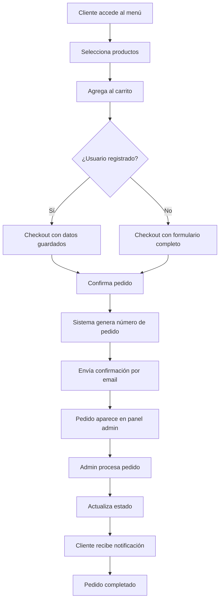
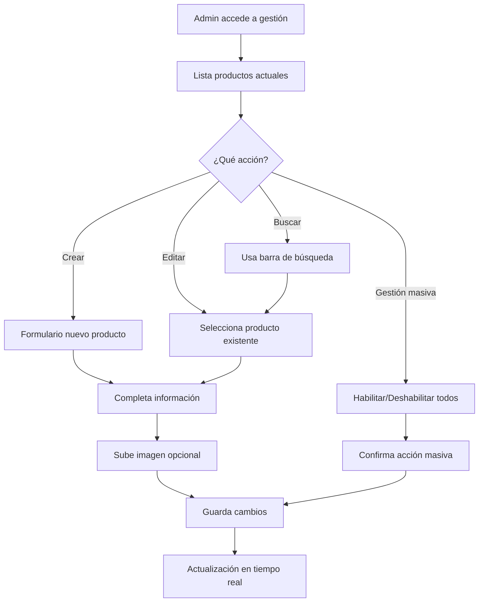
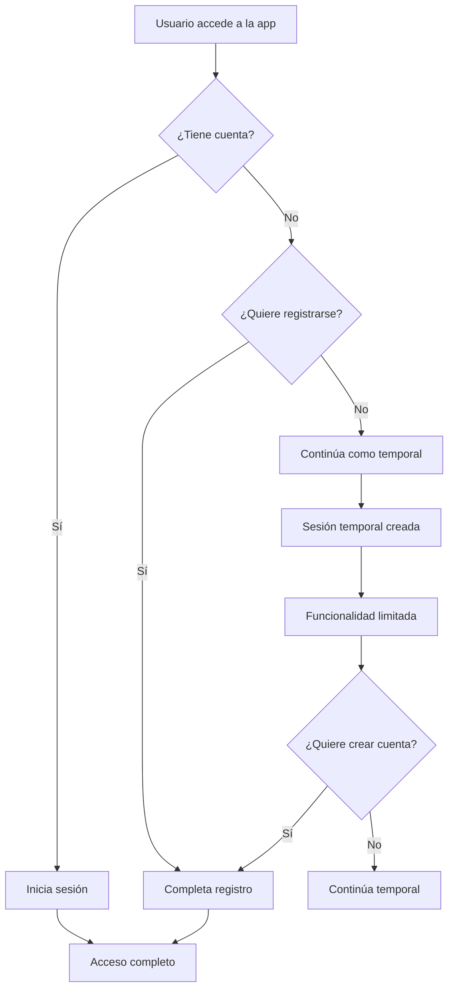

# 🍔 Sistema de Pedidos - Menú Burger

## 📋 Tabla de Contenidos
- [Descripción General](#-descripción-general)
- [Características Principales](#-características-principales)
- [Arquitectura del Sistema](#-arquitectura-del-sistema)
- [Funcionalidades Detalladas](#-funcionalidades-detalladas)
- [Casos de Uso](#-casos-de-uso)
- [Flujos de Trabajo](#-flujos-de-trabajo)
- [Aspectos Técnicos](#-aspectos-técnicos)
- [Instalación y Configuración](#-instalación-y-configuración)
- [API y Servicios](#-api-y-servicios)
- [Interfaz de Usuario](#-interfaz-de-usuario)

## 🎯 Descripción General

**Menú Burger** es una aplicación web completa para la gestión de pedidos de un restaurante de hamburguesas. El sistema permite a los clientes navegar por el menú, realizar pedidos, hacer seguimiento de sus órdenes y dejar reseñas. Los administradores pueden gestionar productos, pedidos, usuarios y obtener estadísticas en tiempo real.

### 🌟 Características Principales

#### 🔐 **Sistema de Autenticación Avanzado**
- **Usuarios Registrados**: Login/registro completo con perfiles persistentes
- **Usuarios Temporales**: Sistema innovador para usuarios anónimos con sesiones temporales
- **Roles de Usuario**: Cliente y Administrador con permisos diferenciados
- **Gestión de Sesiones**: Tokens JWT con expiración automática
- **Perfiles de Usuario**: Información personal, historial de pedidos, preferencias

#### 🛒 **Sistema de Pedidos Inteligente**
- **Carrito de Compras**: Gestión dinámica de productos con cantidades
- **Checkout Flexible**: Proceso de compra para usuarios registrados y anónimos
- **Seguimiento en Tiempo Real**: Estados de pedido actualizados automáticamente
- **Notificaciones**: Sistema de alertas por email y en la aplicación
- **Historial de Pedidos**: Acceso completo al historial para usuarios registrados

#### 🍔 **Gestión de Productos**
- **Catálogo Dinámico**: Menú organizado por categorías (Burgers, Papas, Bebidas, Salsas, Agregados)
- **Búsqueda Avanzada**: Filtrado en tiempo real por nombre de producto
- **Gestión de Disponibilidad**: Control individual y masivo de productos
- **Subida de Imágenes**: Sistema de carga de imágenes para productos
- **Precios Dinámicos**: Gestión flexible de precios

#### 👨‍💼 **Panel Administrativo Completo**
- **Dashboard de Estadísticas**: Métricas en tiempo real de ventas y pedidos
- **Gestión de Pedidos**: Control completo del flujo de órdenes
- **Gestión de Productos**: CRUD completo con búsqueda y filtros
- **Gestión de Usuarios**: Administración de cuentas y roles
- **Sistema de Reseñas**: Moderación y aprobación de comentarios

#### 📱 **Interfaz de Usuario Moderna**
- **Diseño Responsivo**: Optimizado para móviles, tablets y desktop
- **UI/UX Intuitiva**: Navegación fluida y experiencia de usuario optimizada
- **Tema Moderno**: Diseño atractivo con Tailwind CSS
- **Componentes Interactivos**: Modales, notificaciones, animaciones
- **Accesibilidad**: Diseño inclusivo y accesible

## 🏗️ Arquitectura del Sistema

### **Frontend (React + Vite)**
```
src/
├── components/          # Componentes reutilizables
├── pages/              # Páginas principales
├── services/           # Servicios y lógica de negocio
├── config/             # Configuraciones
└── utils/              # Utilidades y helpers
```

### **Backend (Node.js + SQLite)**
```
database/
└── restaurant.db       # Base de datos SQLite

server.js               # Servidor Express
```

### **Base de Datos (SQLite)**
```sql
-- Tablas principales
users           # Usuarios del sistema
products        # Catálogo de productos
orders          # Pedidos realizados
reviews         # Reseñas de clientes
activity_logs   # Logs de actividad
```

## 🔧 Funcionalidades Detalladas

### 🏠 **Página Principal (Landing)**
- **Hero Section**: Presentación atractiva del restaurante
- **Navegación**: Menú de navegación con acceso a todas las secciones
- **Call-to-Action**: Botones para acceder al menú y realizar pedidos
- **Información del Restaurante**: Detalles de contacto y ubicación

### 🍽️ **Página del Menú**
- **Categorías de Productos**: Organización por tipos (Burgers, Papas, Bebidas, etc.)
- **Tarjetas de Producto**: Información detallada con imagen, precio y descripción
- **Carrito Lateral**: Vista en tiempo real de productos seleccionados
- **Búsqueda**: Filtrado instantáneo por nombre de producto
- **Modal de Producto**: Vista detallada con opciones de personalización

### 🛒 **Sistema de Carrito y Checkout**
- **Gestión de Cantidades**: Incrementar/decrementar productos
- **Cálculo Automático**: Subtotal, impuestos y total
- **Información de Entrega**: Formulario completo para datos del cliente
- **Validación**: Verificación de datos antes del envío
- **Confirmación**: Página de confirmación con detalles del pedido

### 📊 **Panel Administrativo**

#### **Dashboard Principal**
- **Métricas en Tiempo Real**:
  - Total de pedidos del día
  - Ingresos generados
  - Productos más vendidos
  - Usuarios activos
- **Gráficos y Estadísticas**: Visualización de datos de ventas
- **Accesos Rápidos**: Enlaces a funciones principales

#### **Gestión de Pedidos**
- **Lista de Pedidos**: Vista completa con filtros por estado
- **Estados de Pedido**:
  - 🟡 Pendiente
  - 🔵 Preparando
  - 🟢 En Camino
  - ✅ Entregado
  - ❌ Cancelado
- **Edición de Pedidos**: Modificación de estado y detalles
- **Notificaciones**: Alertas automáticas por cambios de estado

#### **Gestión de Productos**
- **CRUD Completo**: Crear, leer, actualizar y eliminar productos
- **Búsqueda y Filtros**: Localización rápida de productos
- **Gestión de Imágenes**: Subida y gestión de fotos de productos
- **Control de Disponibilidad**: 
  - Habilitar/deshabilitar productos individuales
  - Acciones masivas (habilitar/deshabilitar todos)
- **Categorización**: Organización por categorías

### 👤 **Sistema de Usuarios**

#### **Usuarios Registrados**
- **Perfil Completo**: Información personal, contacto y preferencias
- **Historial de Pedidos**: Acceso a todos los pedidos realizados
- **Seguimiento**: Estado en tiempo real de pedidos activos
- **Reseñas**: Capacidad de dejar comentarios y calificaciones

#### **Usuarios Temporales (Innovación)**
- **Sesiones Temporales**: Sistema para usuarios no registrados
- **Persistencia de Datos**: Información guardada durante la sesión
- **Conversión**: Opción de crear cuenta permanente
- **Notificaciones**: Recordatorios para crear cuenta

### 📧 **Sistema de Notificaciones**
- **Notificaciones en Tiempo Real**: Alertas instantáneas en la aplicación
- **Email Automático**: Confirmaciones y actualizaciones por correo
- **Centro de Notificaciones**: Panel centralizado de alertas
- **Configuración**: Preferencias de notificación por usuario

### ⭐ **Sistema de Reseñas**
- **Calificaciones**: Sistema de estrellas (1-5)
- **Comentarios**: Reseñas textuales de clientes
- **Moderación**: Aprobación administrativa de reseñas
- **Visualización**: Página dedicada para mostrar reseñas

## 📋 Casos de Uso

### 🎯 **Caso de Uso 1: Cliente Realiza Pedido (Usuario Anónimo)**
```
Actor: Cliente no registrado
Objetivo: Realizar un pedido sin crear cuenta

Flujo Principal:
1. Cliente accede al menú
2. Navega por categorías de productos
3. Agrega productos al carrito
4. Procede al checkout
5. Completa información de entrega
6. Confirma el pedido
7. Recibe confirmación y número de seguimiento
8. Sistema crea perfil temporal automáticamente

Resultado: Pedido creado exitosamente con seguimiento disponible
```

### 🎯 **Caso de Uso 2: Cliente Registrado Realiza Pedido**
```
Actor: Cliente registrado
Objetivo: Realizar pedido con datos guardados

Flujo Principal:
1. Cliente inicia sesión
2. Navega el menú con recomendaciones personalizadas
3. Agrega productos al carrito
4. Checkout con datos pre-llenados
5. Confirma pedido
6. Pedido se guarda en historial personal

Resultado: Pedido registrado en historial del usuario
```

### 🎯 **Caso de Uso 3: Administrador Gestiona Pedidos**
```
Actor: Administrador
Objetivo: Procesar y gestionar pedidos

Flujo Principal:
1. Administrador accede al panel
2. Revisa pedidos pendientes
3. Actualiza estado de pedidos
4. Sistema envía notificaciones automáticas
5. Genera reportes de ventas

Resultado: Pedidos procesados eficientemente
```

### 🎯 **Caso de Uso 4: Gestión de Productos**
```
Actor: Administrador
Objetivo: Mantener catálogo actualizado

Flujo Principal:
1. Accede a gestión de productos
2. Busca producto específico
3. Edita información (precio, disponibilidad, descripción)
4. Sube nueva imagen si es necesario
5. Guarda cambios
6. Cambios se reflejan inmediatamente en el menú

Resultado: Catálogo actualizado en tiempo real
```

## 🔄 Flujos de Trabajo

### **Flujo de Pedido Completo**


### **Flujo de Gestión de Productos**


### **Flujo de Autenticación**


## 💻 Aspectos Técnicos

### **Stack Tecnológico**
- **Frontend**: React 18, Vite, Tailwind CSS
- **Backend**: Node.js, Express
- **Base de Datos**: SQLite con better-sqlite3
- **Autenticación**: JWT (JSON Web Tokens)
- **Notificaciones**: EmailJS, Sistema interno
- **Estado**: React Hooks, Context API
- **Routing**: React Router DOM
- **Iconos**: Lucide React

### **Características Técnicas Avanzadas**

#### **Sistema de Base de Datos Híbrido**
- **SQLite Principal**: Base de datos principal para producción
- **Fallback System**: Sistema de respaldo con localStorage
- **Migración Automática**: Scripts de migración entre sistemas
- **Sincronización**: Sync entre diferentes fuentes de datos

#### **Gestión de Estado Avanzada**
- **Servicios Modulares**: Arquitectura de servicios independientes
- **Event System**: Sistema de eventos para comunicación entre componentes
- **Broadcast Channel**: Sincronización entre pestañas
- **Persistencia**: Datos guardados automáticamente

#### **Sistema de Notificaciones**
- **Tiempo Real**: Notificaciones instantáneas
- **Múltiples Canales**: Email, in-app, browser notifications
- **Queue System**: Cola de notificaciones para envío masivo
- **Configuración**: Preferencias personalizables

#### **Optimizaciones de Rendimiento**
- **Lazy Loading**: Carga diferida de componentes
- **Memoización**: Optimización de re-renders
- **Debouncing**: Optimización de búsquedas
- **Image Optimization**: Compresión y optimización de imágenes

### **Seguridad**
- **Validación de Datos**: Validación tanto frontend como backend
- **Sanitización**: Limpieza de inputs del usuario
- **CORS**: Configuración de Cross-Origin Resource Sharing
- **Rate Limiting**: Limitación de requests por IP
- **SQL Injection Prevention**: Uso de prepared statements

## 🚀 Instalación y Configuración

### **Requisitos Previos**
- Node.js 18+ 
- npm o yarn
- Git

### **Instalación**
```bash
# Clonar repositorio
git clone [repository-url]
cd menu-burger

# Instalar dependencias
npm install

# Configurar base de datos
npm run setup-db

# Iniciar servidor de desarrollo
npm run dev

# Iniciar servidor backend (en otra terminal)
npm run server
```

### **Configuración de Base de Datos**
```javascript
// src/config/database.js
export const DATABASE_CONFIG = {
  type: 'sqlite', // 'sqlite' o 'hybrid'
  sqlite: {
    path: './database/restaurant.db',
    options: {
      verbose: console.log // Para debugging
    }
  }
};
```

### **Variables de Entorno**
```env
# Email Service (EmailJS)
VITE_EMAILJS_SERVICE_ID=your_service_id
VITE_EMAILJS_TEMPLATE_ID=your_template_id
VITE_EMAILJS_PUBLIC_KEY=your_public_key

# JWT Secret
JWT_SECRET=your_super_secret_key

# Server Configuration
PORT=3001
```

## 🔌 API y Servicios

### **Servicios Principales**

#### **AuthService**
```javascript
// Autenticación y gestión de usuarios
- register(userData)
- login(credentials)
- logout()
- getCurrentUser()
- updateProfile(updates)
- checkTempSession()
```

#### **OrderManager**
```javascript
// Gestión de pedidos
- addOrder(orderData)
- getOrders(filters)
- updateOrderStatus(orderId, status)
- getOrderById(orderId)
- getOrderHistory(userId)
```

#### **ApiService**
```javascript
// Comunicación con base de datos
- getProducts()
- createProduct(productData)
- updateProduct(id, updates)
- deleteProduct(id)
- uploadImage(file)
```

#### **NotificationService**
```javascript
// Sistema de notificaciones
- addNotification(notification)
- getNotifications()
- markAsRead(notificationId)
- clearAll()
```

### **Endpoints API**

#### **Productos**
```
GET    /api/products          # Obtener todos los productos
POST   /api/products          # Crear nuevo producto
PUT    /api/products/:id      # Actualizar producto
DELETE /api/products/:id      # Eliminar producto
POST   /api/upload            # Subir imagen
```

#### **Pedidos**
```
GET    /api/orders            # Obtener pedidos
POST   /api/orders            # Crear pedido
PUT    /api/orders/:id        # Actualizar pedido
GET    /api/orders/:id        # Obtener pedido específico
```

#### **Usuarios**
```
POST   /api/auth/register     # Registro de usuario
POST   /api/auth/login        # Inicio de sesión
GET    /api/auth/profile      # Obtener perfil
PUT    /api/auth/profile      # Actualizar perfil
```

## 🎨 Interfaz de Usuario

### **Diseño Visual**

#### **Paleta de Colores**
- **Primario**: Naranjas y rojos (tema burger)
- **Secundario**: Amarillos (papas fritas)
- **Neutros**: Grises para texto y fondos
- **Estados**: Verde (éxito), Rojo (error), Azul (información)

#### **Tipografía**
- **Títulos**: Fuentes bold y llamativas
- **Texto**: Fuentes legibles y modernas
- **Tamaños**: Sistema responsivo de tamaños

#### **Componentes UI**

##### **Navegación**
- **Navbar Responsivo**: Menú hamburguesa en móviles
- **Breadcrumbs**: Navegación contextual
- **Tabs**: Organización de contenido por categorías

##### **Formularios**
- **Validación en Tiempo Real**: Feedback inmediato
- **Estados Visuales**: Loading, error, success
- **Campos Inteligentes**: Autocompletado y sugerencias

##### **Modales y Overlays**
- **Confirmaciones**: Diálogos de confirmación para acciones críticas
- **Detalles de Producto**: Vista expandida con información completa
- **Checkout**: Proceso de compra paso a paso

##### **Feedback Visual**
- **Notificaciones Toast**: Alertas no intrusivas
- **Loading States**: Indicadores de carga
- **Empty States**: Mensajes cuando no hay contenido

### **Experiencia de Usuario (UX)**

#### **Navegación Intuitiva**
- **Flujo Lógico**: Secuencia natural de acciones
- **Accesos Rápidos**: Shortcuts para funciones comunes
- **Breadcrumbs**: Orientación constante del usuario

#### **Responsive Design**
- **Mobile First**: Diseño optimizado para móviles
- **Breakpoints**: Adaptación a diferentes tamaños de pantalla
- **Touch Friendly**: Elementos táctiles apropiados

#### **Accesibilidad**
- **Contraste**: Colores con contraste adecuado
- **Keyboard Navigation**: Navegación por teclado
- **Screen Readers**: Compatibilidad con lectores de pantalla
- **ARIA Labels**: Etiquetas descriptivas para elementos

#### **Performance UX**
- **Carga Rápida**: Optimización de tiempos de carga
- **Feedback Inmediato**: Respuesta instantánea a acciones
- **Offline Support**: Funcionalidad básica sin conexión

## 📈 Métricas y Analytics

### **Dashboard de Administración**
- **Ventas Diarias**: Ingresos por día/semana/mes
- **Productos Populares**: Ranking de productos más vendidos
- **Usuarios Activos**: Estadísticas de usuarios registrados vs temporales
- **Estados de Pedidos**: Distribución de pedidos por estado
- **Tiempo de Procesamiento**: Métricas de eficiencia operativa

### **KPIs Principales**
- **Conversión**: Porcentaje de visitantes que realizan pedidos
- **Ticket Promedio**: Valor promedio por pedido
- **Tiempo de Entrega**: Tiempo promedio desde pedido hasta entrega
- **Satisfacción**: Rating promedio de reseñas
- **Retención**: Porcentaje de clientes que repiten

## 🔮 Funcionalidades Futuras

### **Próximas Implementaciones**
- **Sistema de Cupones**: Descuentos y promociones
- **Programa de Lealtad**: Puntos y recompensas
- **Integración de Pagos**: Pasarelas de pago online
- **Delivery Tracking**: Seguimiento GPS en tiempo real
- **Chat en Vivo**: Soporte al cliente integrado
- **App Móvil**: Aplicación nativa iOS/Android
- **Multi-idioma**: Soporte para múltiples idiomas
- **Analytics Avanzados**: Reportes detallados y predicciones

### **Mejoras Técnicas Planificadas**
- **Microservicios**: Arquitectura distribuida
- **Cache Redis**: Optimización de rendimiento
- **CDN**: Distribución de contenido global
- **Testing Automatizado**: Suite completa de tests
- **CI/CD**: Pipeline de integración continua
- **Monitoring**: Monitoreo de aplicación en tiempo real

---

## 📞 Contacto y Soporte

Para soporte técnico o consultas sobre el sistema, contactar al equipo de desarrollo.

**Credenciales de Administrador por Defecto:**
- Usuario: `admin`
- Contraseña: `admin123`

---

*Documentación actualizada - Versión 2.0*
*Sistema desarrollado con ❤️ para la mejor experiencia de pedidos online*

## 🍔 Funcionalidades Implementadas

El sistema de pedidos permite a los usuarios realizar pedidos completos sin necesidad de una base de datos, utilizando tecnologías web modernas para notificar al local.

### ✅ Características Principales

1. **Formulario de Checkout Completo**
   - Datos del cliente (nombre, teléfono, email, dirección)
   - Validación de formularios en tiempo real
   - Selección de método de notificación
   - Notas adicionales para el pedido

2. **Persistencia Local**
   - Los pedidos se guardan en `localStorage` del navegador
   - Historial de pedidos disponible localmente
   - No requiere base de datos externa

3. **Sistema de Notificaciones**
   - **Email**: Usando EmailJS (requiere configuración)
   - **WhatsApp**: Enlace directo a WhatsApp Web
   - **Copia al portapapeles**: Para usar en cualquier plataforma

4. **Confirmación de Pedido**
   - Resumen completo del pedido
   - Detalles del cliente
   - Opciones múltiples de notificación
   - Interfaz intuitiva y profesional

## 📧 Configuración de EmailJS

### Paso 1: Crear Cuenta en EmailJS
1. Ve a [https://www.emailjs.com/](https://www.emailjs.com/)
2. Crea una cuenta gratuita
3. Verifica tu email

### Paso 2: Configurar Servicio de Email
1. En el dashboard, ve a "Email Services"
2. Haz clic en "Add New Service"
3. Selecciona tu proveedor (Gmail, Outlook, etc.)
4. Sigue las instrucciones para conectar tu cuenta
5. Anota el **Service ID** generado

### Paso 3: Crear Template de Email
1. Ve a "Email Templates"
2. Haz clic en "Create New Template"
3. Usa el siguiente template como base:

```html
<!DOCTYPE html>
<html>
<head>
    <title>Nuevo Pedido - Burger Place</title>
</head>
<body>
    <h2>🍔 Nuevo Pedido Recibido</h2>
    
    <h3>📋 Información del Pedido</h3>
    <p><strong>Pedido #:</strong> {{order_id}}</p>
    <p><strong>Fecha:</strong> {{order_date}}</p>
    
    <h3>👤 Datos del Cliente</h3>
    <p><strong>Nombre:</strong> {{customer_name}}</p>
    <p><strong>Teléfono:</strong> {{customer_phone}}</p>
    <p><strong>Email:</strong> {{customer_email}}</p>
    <p><strong>Dirección:</strong> {{customer_address}}</p>
    <p><strong>Método de notificación preferido:</strong> {{notification_method}}</p>
    
    <h3>🍔 Productos Pedidos</h3>
    <pre>{{order_items}}</pre>
    
    <h3>💰 Total del Pedido</h3>
    <p style="font-size: 18px; font-weight: bold; color: #f59e0b;">{{order_total}}</p>
    
    <h3>📝 Notas Adicionales</h3>
    <p>{{order_notes}}</p>
    
    <hr>
    <p><em>Este pedido fue generado automáticamente desde el menú web.</em></p>
</body>
</html>
```

4. Guarda el template y anota el **Template ID**

### Paso 4: Obtener Public Key
1. Ve a "Account" → "General"
2. Copia tu **Public Key**

### Paso 5: Configurar en el Código
1. Abre el archivo `src/services/emailService.js`
2. Reemplaza los valores en `EMAIL_CONFIG`:

```javascript
const EMAIL_CONFIG = {
  serviceId: 'tu_service_id_aqui',
  templateId: 'tu_template_id_aqui', 
  publicKey: 'tu_public_key_aqui'
};
```

## 📱 Configuración de WhatsApp

### Actualizar Número de WhatsApp
1. Abre `src/components/OrderConfirmation.jsx`
2. Busca la línea con `const phoneNumber = '56912345678';`
3. Reemplaza con el número de WhatsApp del local (formato: código país + número sin +)

Ejemplo para Chile:
```javascript
const phoneNumber = '56987654321'; // +56 9 8765 4321
```

## 🚀 Cómo Usar el Sistema

### Para los Clientes:
1. Navegar por el menú y agregar productos al carrito
2. Hacer clic en "Proceder al Pago" en el carrito
3. Llenar el formulario con sus datos
4. Seleccionar método de notificación preferido
5. Confirmar el pedido
6. Usar los botones de notificación para contactar al local

### Para el Local:
1. **Email**: Recibirás emails automáticos con los detalles del pedido
2. **WhatsApp**: Los clientes pueden enviarte el pedido directamente
3. **Historial**: Los pedidos se guardan localmente en cada dispositivo

## 🔧 Funciones Técnicas

### Validaciones Implementadas
- Nombre requerido
- Teléfono requerido y formato válido
- Email requerido si se selecciona notificación por email
- Dirección requerida
- Formato de email válido

### Persistencia de Datos
```javascript
// Los pedidos se guardan en localStorage
const orders = JSON.parse(localStorage.getItem('burger-orders') || '[]');
```

### Estructura de Datos del Pedido
```javascript
{
  id: "timestamp_string",
  customer: {
    name: "string",
    phone: "string", 
    email: "string",
    address: "string",
    notes: "string",
    notificationMethod: "email|whatsapp|phone"
  },
  items: [
    {
      id: "string",
      name: "string",
      price: number,
      quantity: number,
      icon: "string"
    }
  ],
  total: number,
  timestamp: "ISO_string",
  status: "pending"
}
```

## 🛠️ Personalización

### Cambiar Email de Destino
En el template de EmailJS, puedes configurar a qué email llegan las notificaciones.

### Modificar Campos del Formulario
Edita `src/components/Checkout.jsx` para agregar o quitar campos.

### Personalizar Mensajes
Modifica los textos en `src/components/OrderConfirmation.jsx` para personalizar los mensajes de WhatsApp y email.

## 🐛 Solución de Problemas

### EmailJS no funciona
1. Verifica que las credenciales estén correctas
2. Revisa la consola del navegador para errores
3. Asegúrate de que el template tenga todas las variables
4. Verifica que el servicio de email esté activo

### WhatsApp no abre
1. Verifica que el número esté en formato correcto
2. Asegúrate de que WhatsApp Web esté disponible
3. Revisa que el navegador permita abrir enlaces externos

### Pedidos no se guardan
1. Verifica que localStorage esté habilitado
2. Revisa la consola para errores de JavaScript
3. Asegúrate de que no haya problemas de memoria

## 📞 Soporte

Para soporte técnico o preguntas sobre la implementación, revisa:
1. La consola del navegador para errores
2. Los logs de EmailJS en su dashboard
3. La documentación oficial de EmailJS

---

**¡El sistema está listo para usar!** Solo necesitas configurar EmailJS y actualizar el número de WhatsApp para tener un sistema completo de pedidos sin base de datos.